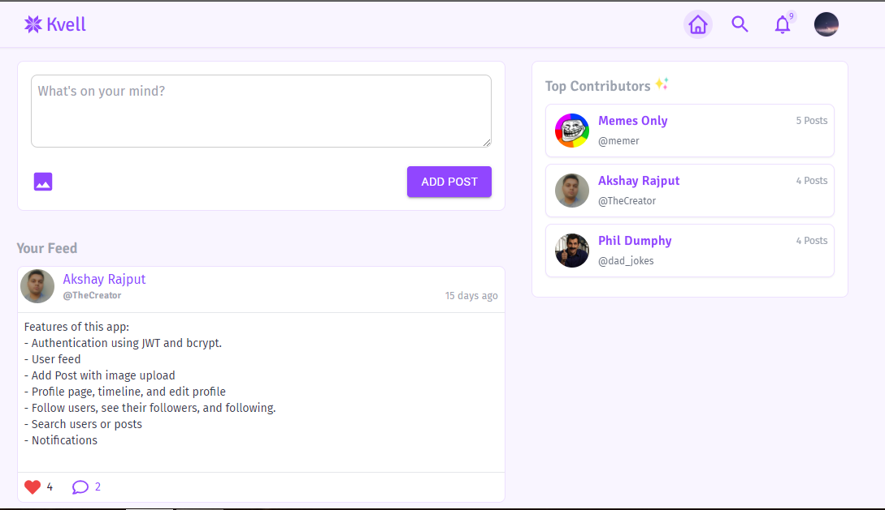

<!-- PROJECT LOGO -->
<p align="center">
  <a href="https://github.com/akshay-rajput/kvell-app/">
    
  </a>

  <h3 align="center">Kvell</h3>

  <p align="center">
    A social media app with all basic features implemented. 
    <br />
    <a href="https://kvell.netlify.app/" target="_blank">View Demo</a>
    ·
    <a href="https://github.com/akshay-rajput/kvell-app/issues">Report Bug</a>
  </p>
</p>


<!-- TABLE OF CONTENTS -->
<details open="open">
  <summary><h2 style="display: inline-block">Table of Contents</h2></summary>
  <ol>
    <li>
      <a href="#about-the-project">About The Project</a>
      <ul>
        <li><a href="#built-with">Built With</a></li>
      </ul>
    </li>
    <li>
      <a href="#getting-started">Getting Started</a>
      <ul>
        <li><a href="#prerequisites">Prerequisites</a></li>
        <li><a href="#installation">Installation</a></li>
      </ul>
    </li>
    <li><a href="#contact">Contact</a></li>
  </ol>
</details>


<!-- ABOUT THE PROJECT -->
## About The Project



A social media app where a user can create posts, follow other users, like and comment on posts, check profile of other users, update own profile, get notifications and search posts or users.
This app uses Redux Toolkit for state management. Implemented features include dynamic routing, searching a user or post, follow user, user management, add post, like/comment on post, get notifications, JWT authentication etc. 

### Built With

* [Reactjs](https://reactjs.org/docs/getting-started.html)
* [react-router](https://reactrouter.com/)
* [Redux toolkit](https://redux-toolkit.js.org/)
* [Styled components](https://styled-components.com/)
* [TailwindCSS](https://tailwindcss.com/)

<!-- GETTING STARTED -->
## Getting Started

This project uses [Vite](https://vitejs.dev/) as a build tool.
To get a local copy up and running follow these simple steps.

### Prerequisites

Vite requires Node.js version >=12.0.0.
* npm
  ```sh
  npm install npm@latest -g
  ```

### Installation

1. Clone the repo
   ```sh
   git clone https://github.com/akshay-rajput/kvell-app.git
   ```
2. Install NPM packages
   ```sh
   npm install
   ```
3. Start dev server
   ```sh
   npm run dev
   ```

## Contact

Reach out to me [@twitter](https://twitter.com/_AkshayRajput)

Project Link: [Netlify](https://kvell.netlify.app)
